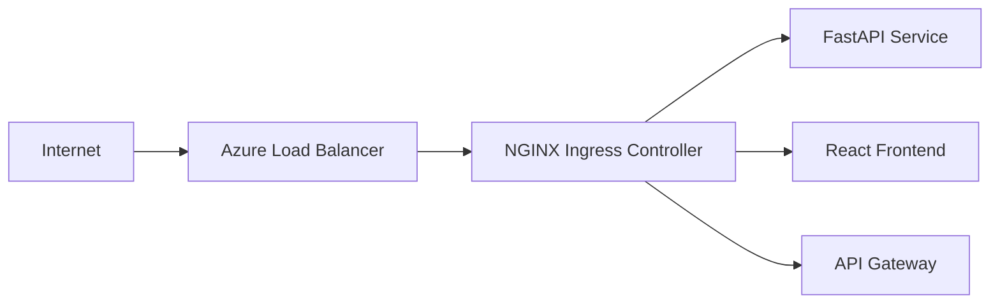
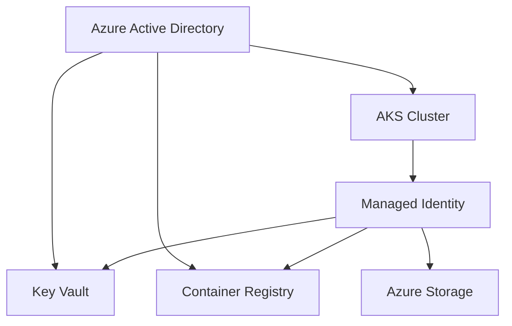
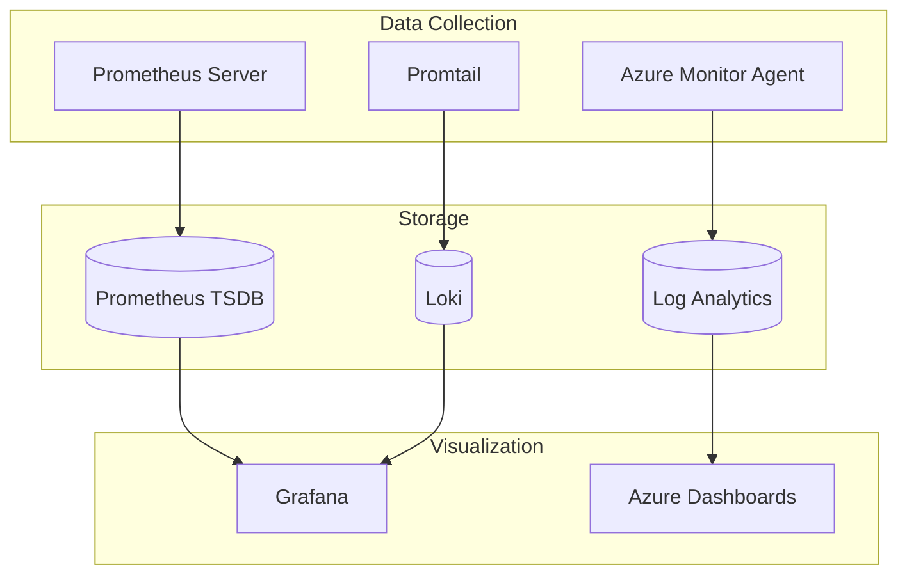
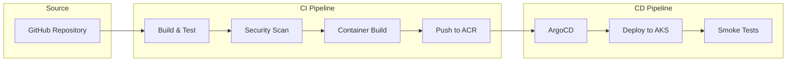

# 🏗️ Architecture Deep Dive

## Overview

This document provides a comprehensive overview of the Azure DevOps platform architecture, including design decisions, trade-offs, and implementation details.

## 🎯 **Design Principles**

### **1. Security First**
- Zero-trust network architecture
- Least-privilege access control
- Defense-in-depth security layers
- Automated compliance enforcement

### **2. Cloud-Native**
- Containerized applications
- Microservices architecture  
- Auto-scaling capabilities
- Infrastructure as Code

### **3. Observability**
- Comprehensive monitoring
- Distributed tracing
- Centralized logging
- Proactive alerting

### **4. Cost Optimization**
- Right-sized resources
- Auto-scaling policies
- Reserved capacity planning
- Resource lifecycle management

---

## 🌐 **Network Architecture**

### **VNet Design**
```
Production VNet: 10.0.0.0/16
├── AKS Subnet: 10.0.1.0/24          (Kubernetes nodes)
├── CI/CD Subnet: 10.0.2.0/24        (Build agents, runners)  
├── Observability: 10.0.3.0/24       (Monitoring tools)
├── Security Subnet: 10.0.4.0/24     (Security tools, bastion)
├── Data Subnet: 10.0.5.0/24         (Databases, storage)
└── Gateway Subnet: 10.0.255.0/27    (VPN/ExpressRoute gateway)
```

### **Security Boundaries**
- **Public Internet** → **Azure Load Balancer** → **AKS Ingress**
- **Private subnets** with NAT Gateway for outbound-only internet
- **Network Security Groups** (NSGs) for micro-segmentation
- **Private endpoints** for Azure services (Key Vault, ACR, etc.)

### **Traffic Flow**
1. **Ingress**: Internet → Load Balancer → AKS Ingress Controller → Pods
2. **Egress**: Pods → NAT Gateway → Internet
3. **East-West**: Pod-to-Pod via Azure CNI with Network Policies
4. **Management**: Bastion Host → Private subnets (admin access)

---

## ☸️ **Kubernetes Architecture**

### **AKS Cluster Design**
```yaml
Cluster Configuration:
  - Version: 1.28.x (latest stable)
  - Network: Azure CNI with Network Policies
  - Load Balancer: Standard SKU
  - Identity: System-assigned managed identity
  - RBAC: Enabled with Azure AD integration
```

### **Node Pools**
| Pool Name | Purpose | VM Size | Min/Max Nodes | Taints |
|-----------|---------|---------|---------------|--------|
| `system` | System pods | Standard_B2s | 1-3 | CriticalAddonsOnly |
| `general` | Application workloads | Standard_D2s_v3 | 2-10 | None |
| `spot` | Non-critical workloads | Standard_D2s_v3 | 0-5 | spot=true:NoSchedule |

### **Ingress Architecture**


### **Storage Classes**
- **default**: Azure Disk Standard SSD
- **premium**: Azure Disk Premium SSD  
- **azurefile**: Azure Files for shared storage
- **fast**: Azure Ultra Disk for high IOPS workloads

---

## 🔒 **Security Architecture**

### **Identity & Access Management**


### **Secret Management Flow**
1. **Application startup** → Requests secret from Key Vault
2. **AKS Managed Identity** → Authenticates with AAD
3. **Key Vault** → Returns secret via secure channel
4. **CSI Secret Store** → Mounts secrets as volumes

### **Network Security**
- **NSG Rules**: Deny-all default, explicit allow rules
- **Private Endpoints**: All Azure services accessed privately
- **Service Mesh**: Istio for mTLS between services (future)
- **Pod Security Standards**: Restricted security context

### **Compliance & Governance**
- **Azure Policy**: Automated compliance checks
- **Resource Tagging**: Mandatory tags for cost allocation
- **RBAC**: Role-based access control throughout
- **Audit Logging**: All actions logged to Azure Monitor

---

## 📊 **Observability Architecture**

### **Monitoring Stack**


### **Metrics Collection**
- **Infrastructure**: Node metrics, cluster health, resource utilization
- **Applications**: HTTP metrics, business KPIs, error rates
- **Custom Metrics**: Application-specific performance indicators

### **Alerting Strategy**
| Alert Type | Threshold | Action |
|------------|-----------|--------|
| High CPU | >80% for 5min | Scale up pods |
| High Memory | >85% for 3min | Scale up nodes |
| Error Rate | >5% for 2min | Page on-call |
| Latency | >500ms p95 | Slack notification |

---

## 🔄 **CI/CD Architecture**

### **Pipeline Design**


### **GitOps Flow**
1. **Developer** pushes code to feature branch
2. **GitHub Actions** runs CI pipeline (build, test, scan)
3. **On merge** to main, image is built and pushed to ACR
4. **ArgoCD** detects changes in GitOps repo
5. **Automated deployment** to dev environment
6. **Manual approval** for production deployment

### **Environment Strategy**
- **Development**: Auto-deploy on merge to main
- **Staging**: Auto-deploy + integration tests  
- **Production**: Manual approval + blue-green deployment

---

## 💰 **Cost Architecture**

### **Cost Optimization Strategies**

#### **Compute Optimization**
```yaml
Node Pools:
  System Pool:
    VM Size: Standard_B2s (2 vCPU, 4GB RAM)
    Cost: ~$60/month per node
    
  Application Pool: 
    VM Size: Standard_D2s_v3 (2 vCPU, 8GB RAM)
    Cost: ~$95/month per node
    
  Spot Pool:
    VM Size: Standard_D2s_v3 (spot pricing)
    Cost: ~$25/month per node (75% savings)
```

#### **Storage Optimization**  
- **Standard SSD**: For general workloads ($0.05/GB/month)
- **Premium SSD**: For high-performance apps ($0.15/GB/month)
- **Azure Files**: For shared storage ($0.06/GB/month)

#### **Auto-scaling Configuration**
```yaml
Horizontal Pod Autoscaler:
  CPU Target: 70%
  Memory Target: 80%
  Min Replicas: 2
  Max Replicas: 20

Cluster Autoscaler:
  Scale-up: When pods pending >30s
  Scale-down: When node utilization <50% for 10min
```

### **Monthly Cost Breakdown** (Development Environment)
| Resource | Quantity | Unit Cost | Total |
|----------|----------|-----------|-------|
| AKS Cluster | 1 | Free | $0 |
| VM Nodes (B2s) | 2-4 nodes | $60/node | $120-240 |
| Load Balancer | 1 | $20 | $20 |
| Storage (100GB) | 1 | $5 | $5 |
| Container Registry | 1 | $5 | $5 |
| Key Vault | 1 | $3 | $3 |
| **Total** | | | **$153-273** |

---

## 🚀 **Performance Architecture**

### **Scalability Patterns**
- **Horizontal Pod Autoscaling**: Based on CPU/Memory metrics
- **Vertical Pod Autoscaling**: Automatic resource right-sizing  
- **Cluster Autoscaling**: Dynamic node pool scaling
- **Multi-zone Deployment**: High availability across AZs

### **Performance Targets**
| Metric | Target | Implementation |
|--------|--------|----------------|
| API Response Time | <200ms p95 | Connection pooling, caching |
| Throughput | 1000 RPS | Load balancing, auto-scaling |
| Availability | 99.9% | Multi-zone, health checks |
| Recovery Time | <5min | Automated failover |

### **Caching Strategy**
- **CDN**: Azure CDN for static content
- **Application Cache**: Redis for session/data caching  
- **Database Cache**: Query result caching
- **Browser Cache**: Appropriate cache headers

---

## 📈 **Capacity Planning**

### **Growth Projections**
| Timeline | Users | RPS | Nodes | Storage |
|----------|-------|-----|-------|---------|
| Month 1 | 100 | 50 | 2-3 | 50GB |
| Month 6 | 1,000 | 500 | 5-8 | 200GB |
| Year 1 | 10,000 | 2,000 | 10-15 | 1TB |

### **Scaling Triggers**
- **Scale Up**: CPU >70% or Memory >80% for 5 minutes
- **Scale Down**: CPU <30% and Memory <50% for 10 minutes  
- **Emergency Scale**: Queue depth >100 or error rate >10%

---

## 🔧 **Technology Decisions**

### **Why AKS over Alternatives?**
| Criterion | AKS | App Service | Container Instances |
|-----------|-----|-------------|-------------------|
| Flexibility | ✅ High | ⚠️ Medium | ❌ Low |
| Cost (at scale) | ✅ Low | ❌ High | ⚠️ Medium |
| Operations | ⚠️ Complex | ✅ Simple | ✅ Simple |
| Ecosystem | ✅ Rich | ⚠️ Limited | ❌ Basic |

### **Why Terraform over ARM/Bicep?**
- **Multi-cloud capability**: Future AWS/GCP expansion
- **Rich ecosystem**: Thousands of providers
- **State management**: Better drift detection
- **Community**: Larger community and modules

### **Why Prometheus over Azure Monitor?**
- **Cost**: Significantly cheaper for high-volume metrics
- **Flexibility**: Custom metrics and alerting rules
- **Portability**: Works across cloud providers  
- **Ecosystem**: Rich integrations with CNCF tools

---

## 🎯 **Design Trade-offs**

### **Security vs. Usability**
- **Chose**: Private subnets with NAT Gateway
- **Trade-off**: Slight complexity increase
- **Benefit**: Enhanced security posture

### **Cost vs. Performance**  
- **Chose**: Mixed node pools (general + spot)
- **Trade-off**: Potential pod evictions
- **Benefit**: 40-60% cost reduction

### **Simplicity vs. Flexibility**
- **Chose**: Kubernetes over App Service
- **Trade-off**: Higher operational overhead  
- **Benefit**: Future scalability and portability

---

## 📚 **References & Further Reading**

- [Azure Well-Architected Framework](https://docs.microsoft.com/en-us/azure/architecture/framework/)
- [AKS Best Practices](https://docs.microsoft.com/en-us/azure/aks/best-practices)
- [Kubernetes Security Best Practices](https://kubernetes.io/docs/concepts/security/)
- [Prometheus Monitoring Best Practices](https://prometheus.io/docs/practices/)
- [GitOps Principles](https://opengitops.dev/)

---

*This architecture supports the business goals of reliability, security, and cost-effectiveness while maintaining developer productivity and operational simplicity.*
